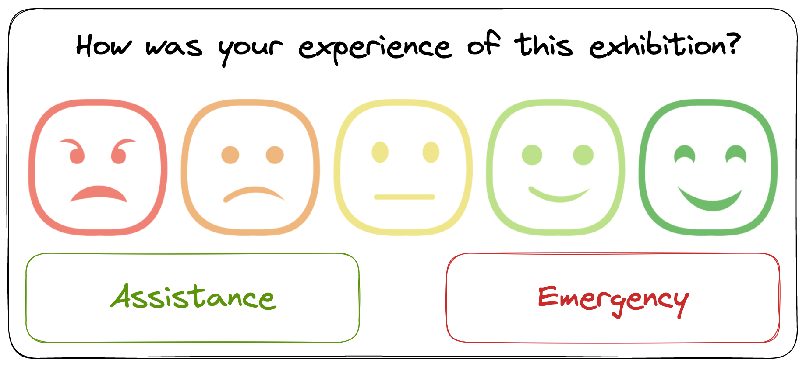

# Museum exhibition data pipeline
This project builds an data pipeline for batch data stored in S3 and real-time stream data in Kafka.
The data pipeline for batch data runs from calling the ```pipeline.py```.


The data pipeline for real-time stream data runs from calling the ```consumer.py```.


The data comes from the kiosks of the Liverpool Museum of Natural History (LVMH)'s 5 exhibitions which lets visitors express their experience.

The kiosks also feature 2 other options: 'Assistance' and 'Emergency'



### Files from S3:
***Historical data in csv files from each exhibition***
Each csv files have the same columns: 

```at``` refers to the date & time of the visitor interaction.

```site``` refers to the unique ID of a specific exhibit.

```val``` is a number representing what button the visitor pushed. Values from ```0``` to ```4``` are ratings, with ```4``` representing the highest rating. A value of ```-1``` means that one of the other buttons ("assistance" or "emergency") has been pressed.

```type``` only has a value when the ```val``` field is ```-1```; ```0``` represents the "assistance" button, ```1``` the "emergency"

While ratings are stored numerically, each one does have an associated description:

0: Terrible
1: Bad
2: Neutral
3: Good
4: Amazing

***Metadata in json files about each exhibition***
Each json file describes a different exhibition and has the following keys:
```EXHIBITION_NAME,EXHIBITION_ID, FLOOR, DEPARTMENT, START_DATE, DESCRIPTION```

## Files Explained

- `README.md`
  - This is the file you are currently reading
- `.gitignore`
  - This file is used to tell Git what files to ignore for any changes. This can be safely ignored.

- `pipeline` folder
  - consumer.py : extracts and loads stream data from Kakfa topic
  - extract.py : extract batch data from S3
  - pipeline.py : transform and load data into the database in RDS
  - ETL pipeline, both batch-processing and Kakfa, and database schema
  - rest_db.py : connects to RDS to clear database and setup database schema
  - schema.sql
  - test_consumer.py
  - test_extract.py
  - analysis.ipynb

- `terraform` folder : terraform AWS set up
  - main.tf
  - output.tf
  - variables.tf
